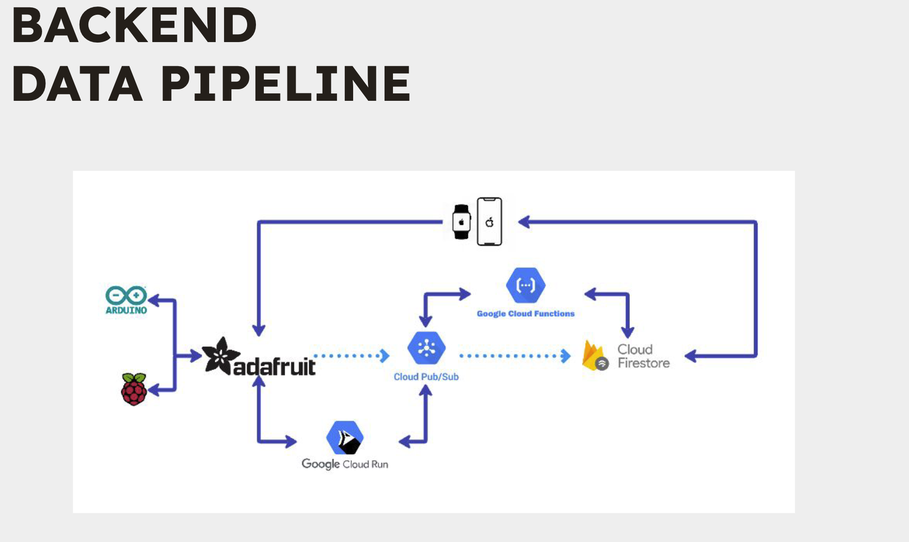
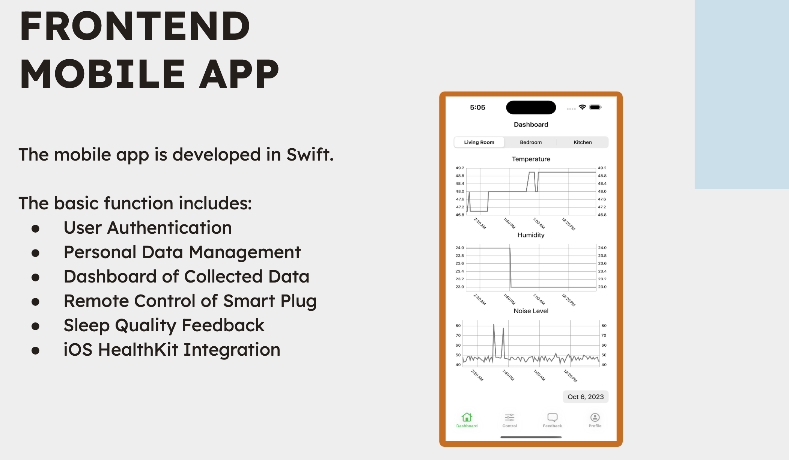

# IoT for better sleep iOS App

Here is a repository of projects on IOT and Deep Learning Applications. The projects originated from a course "Cyber Physical Systems", SEP 769, at McMaster University. The primary aim of the app is to enhance sleep quality using IoT by providing functionalities ranging from user authentication to iOS HealthKit integration.

## Architecture:

<p align="center">
    
</p>

## iOS App:

<p align="center">
    
</p>

<p align="center">
    
</p>

## Features:

- **User Authentication**: Secure sign-in process to protect user data and preferences.
- **Personal Data Management**: Allow users to manage and update their personal data within the app.
- **Dashboard of Collected Data**: Provides a visual representation of the collected data for users to review and analyze.
- **Remote Control of Smart Plug**: Users can remotely control the smart plug, turning devices on or off.
- **Sleep Quality Feedback**: After analyzing the data, the app provides feedback about the user's sleep quality.
- **iOS HealthKit Integration**: The app is integrated with iOS HealthKit to fetch and store health-related metrics.

## Getting Started:

### Prerequisites:

- Xcode (latest version recommended)
- An iOS device running a supported version of iOS.

### Setup:

1. Clone this repository:

   ```bash
   git clone [repository-link]
   ```

2. Navigate to the project directory and pod:

   ```bash
   cd IOTHomeSleepBetter_iOSAPP
   pod install
   ```

3. Open the project in Xcode.

4. **Important**: The `GoogleService-Info.plist` and `Info.plist` are not included in this repository due to security concerns. Ensure you have your own versions of these files and add them to the project before attempting to build.

5. Build and run the project in Xcode.

## Contributing:

Lyle He independently developed this iOS app as part of the course project. If you would like to contribute to this project, please contact the owner.
